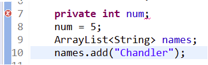

# Java Debugging Tips

## General Tips

- Make sure your package statement is correct in the file
- Make sure your imports are pulling in from the right location (for example, your projects typically should not be importing from the ClassExamples package)
- Hover over the error in Eclipse to see what the error message is

## Syntax Errors

### Multiple markers at this line, Syntax error on token



[Video link](https://youtu.be/U3VsNDDEjWE)

```(text)
Multiple markers at this line
    - Syntax error on token ";", [ expected
    - Syntax error on token ".", @ expected after this token
```

This is usually due to you writing statements at the class level outside a method.  Most often this is in your driver class - make sure you statements are in side the main method:

```(text)
    // Statements here (other than declarations) will have an error
public static void main(String[] args) {
        // Statements here with no error
    }
```
