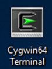
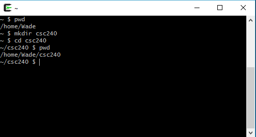
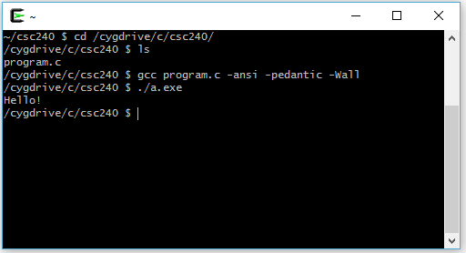
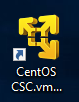
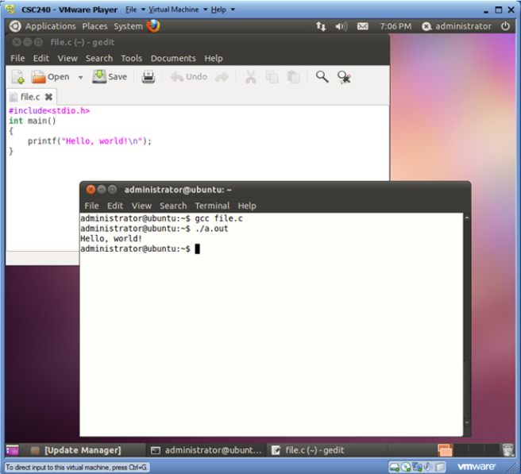

# Setup

***NOTE: you only have to follow one set of instuctions below***

[Windows 11 how to install the Linux Windows Subsystem](https://techcommunity.microsoft.com/t5/windows-11/how-to-install-the-linux-windows-subsystem-in-windows-11/m-p/2701207)

- **Windows 10 & 11** (using Linux Subsystem for Linux & Ubuntu)
  - [Video: Windows 10](https://youtu.be/iPRULLjw96Y) (5:03)
  - [Video: Windows 11](https://youtu.be/L4YdOJFDjj4) (5:18)
- **Windows** (using a Linux virtual machine)
  - [Video: Installing Visual Studio Code & gcc on a Windows 11 Virtual Machine](https://youtu.be/RZIk2IMUsdk) (5:46)
- On **older versions of Windows** (prior to Windows 10) you can install [Cygwin](https://www.cygwin.com/)
- MacOS: You can run gcc from the command line [Video](https://youtu.be/qOchFxcstXU) (4:48)
- Linux: make sure you have gcc installed

No matter what environment you use, make sure you install `gcc`, `g++`, `make`, and (for CSC220) `gdb`.  You may have to choose those separately during Cygwin or Linux installation.  If you forget, you can always install them later - consult the documentation for your system.  You will also need an editor.  For Cygwin, Linux on Windows 10, or MacOS you can use whatever editor you prefer (Vim, Notepad++, Visual Studio Code, etc.).  On Linux I recommend Gedit or Vim.

You need to have a text editor installed.  It doesn't matter what text editor you use, but I recommend Visual Studio Code ([VIDEO: Installing VS Code on Windows 11](https://youtu.be/Ra_EJ_bMduY) (3:47))

Tutorials for compiling C code:

- [Video - Compiling & Running C code (for Java programmers)](https://youtu.be/CPn8nvxbXFs) (7:37) walks through the process of compiling & running a C program under the Windows Subsystem for Linux (Ubuntu).  The process is similar with Cygwin (other than the executable is called a.exe & you the command to change to a drive is ```cd drive:*``` where the drive is the drive letter you want to change to).  The process is also similar to Linux or MacOS, other than the part about navigating to the folder with the code.

Installation directions are shown below.

I have created some videos to demonstrate how to compile under Linux or any other UNIX-like terminal.  Keep in mind that depending on the specific terminal you use, some things may be slightly different, but the overall procedure is the same.  

- A [video with a step-by-step walkthrough of editing, compiling, & running a C program](https://youtu.be/CPn8nvxbXFs) (7:37)
- An [introduction to using the Linux command line for compiling C code](https://youtu.be/jCbawRqwWXU) (8:00)

At the end of this page are more specific directions for editing, compiling, and running C code on the classroom VMs, but the steps are similar on any of the below.  Once you have your environment set up and know which directories to get to then there isn't much difference between working on any of the system.s

I will be using all 4 of the environments listed above in my examples and I use either [Visual Studio Code](https://code.visualstudio.com/) or [Vim](https://www.vim.org/download.php) as my editor.

## Installing Linux on a virtual machine

- Directions for [installing Linux on a VMWare virtual machine](https://www.linux.com/news/installing-virtual-machines-vmware), which will allow you to install & run Linux on your computer without needing to reboot.
- You can download a [free (non-commercial) version of VM Player](https://my.vmware.com/en/web/vmware/free#desktop_end_user_computing/vmware_workstation_player/15_0)

## Windows - Windows Subsystem for Linux

You can install several different Linux distributions in the Microsoft Store.  If you go this route I sugguest Ubuntu, though any distribution should work.  

Installing Ubuntu on Windows:

- VIDEO: [Installing Ubuntu on Windows 10](https://youtu.be/iPRULLjw96Y) (5:03) (including activating the Windows Subsystem for Linux and compiling & running a C program).  To simulate one likely scenario, I forgot to activiate the WSL first before installing Ubuntu.  If you want to do things the easy way you may want to do that part first.  
- VIDEO: [Installing Ubuntu on Windows 11](https://youtu.be/L4YdOJFDjj4) (5:18) is an updated video using Windows 11

**Note**: as soon as you get the command line running you should type the following to ensure you have the latest updates.  When asked for your password, enter your Windows password.

```bash
sudo apt-get update
sudo apt install gcc
sudo apt install g++
sudo apt install make
```

### Compiling C files with the Linux Subsystem for Windows

Once you have installed a Linux distribution from the Windows Store, the simplest way to compile & run your C files is to change to the appropriate directory from inside the Linux window then follow the directions for the VM's above.  

If you save your files in a directory called ```csc240``` on your ```C:``` drive:


Then you can change to that directory in the Linux window using the command

```bash
cd /mnt/c/csc240
```

You should modify the drive letter & directory as necessary.

## Installing Cygwin on Windows

- [Cygwin](https://www.cygwin.com/) is a good choice if you want to be able to run UNIX commands on Windows without doing a full Linux install.  This also allows you to use your favorite Windows editory.  Be sure to install at least gcc & g++.  You will also want to install make & cppcheck.  
- VIDEO: [Installing C & C++ Compiler for Windows 7, 8.1, & 10](https://youtu.be/DAlS4hF_PbY) - Cygwin has a pretty thorough walkthrough of installing Cygwin all the way through compiling a C program.
- VIDEO: [Installing Cygwin on Windows by James Jardine](https://www.youtube.com/watch?v=zRbbDkDb5UM) is another nice walkthrough of the installation process

### Using C with Cygwin

After installing Cygwin you should se an icon on your desktop like below:



Double-clicking the icon should bring up a Cygwin terminal like below:



### Editing Cygwin Files

You can edit files in a second Cygwin terminal (using vim or pico), but you may prefer to edit the files using a Windows editor.  You can either edit files under the Cygwin home directory or change to a Windows directory.  

#### Editing files under the Cygwin home directory

The Cygwin home directory is selected during installation.  Typically it is under ```C:\cygwin``` or ```C:\cygwin64```.  Under that installation directory, navigate to ```home\username```.  That is your Cygwin home directory.


Once you navigate to that directory (or whatever subdirectory you want to storeyour files) you can edit and save files there with your favorite text editor.

#### Editing files in a regular Windows directory

If you already have a directory where you store your code you can navigate to that directory under Cygwin.  Suppose you have a directory called ```csc240``` on your ```C:``` drive.


You can access your Windows drives by changing to the directory ```/cygdrive/driveletter```.  Note the leading slash.  Replace driveletter with the appripriate drive letter, for example ```/cygdrive/c``` will be your computer's ```C:``` drive.



## MacOS

The Mac Terminal should be sufficient for what we do in this class.  You will need to install Xcode to get access to gcc/g++.  On Mac I use [iTerm2](https://www.iterm2.com/) which is a replacment for the built in terminal.  

## Using C on a Virtual Machine

Note that the instructions below relate to the VMs on the classroom & lab computers, but the steps are essentially the same (with slightly different look & feel)) on Windows 10, Cygwin, Linux, or MacOS.



- Start the virtual machine (on the classroom computers there should be a virtual machine like abovek with the VMWare Icon with "CentOS CSC24" or something similar in the name)
- Log on (use the default user if you are on the classroom VM)
- Start a terminal (Applications -> Accessories -> Terminal)
- Edit the file using one of the following commands:
  - ```gedit file.c &```
  - ```vi file.c```
- Run your programm using the command

```bash
./a.out
```



## Sample Session

The text below is from a session on the classroom VM.  I've added comments (Starting with '#') describing what each command does.  The commands below should be the same on Linux, MacOS, Cygwin, or Bash for Windows.

```bash
[student@localhost ~]$ ls                  # List the files in the current directory
Desktop Documents Downloads Music Pictures Public Templates Videos
[student@localhost ~]$ mkdir 240           # Create a directory
[student@localhost ~]$ cd 240/             # Change to directory 240
[student@localhost 240]$ ls                # List the files in the current directory
[student@localhost 240]$ pwd               # Show the current directory
/home/student/240
[student@localhost 240]$ gedit first.c &   # Edit first.c with gedit (note that the & is important - it tells Linux to run gedit in the background which lets you keep using the current terminal session)
[1] 3600
[student@localhost 240]$ cat first.c       # Display the contents of first.c
#include<stdio.h>

int main() {
   printf("Hello, world!");
   return 0;
}
[student@localhost 240]$ gcc --std=c11 -pedantic -Wall first.c # Compile
[student@localhost 240]$ ls                # Notice the new file - a.out.  That is the executable that is generated when we compile.  
a.out first.c
[student@localhost 240]$ a.out
bash: a.out: command not found...          # Linux does not look in the current directory by default
[student@localhost 240]$ ./a.out           # Specify to look in the current directory (./) for the file to run.
Hello, world!                              # Output from the program
```
